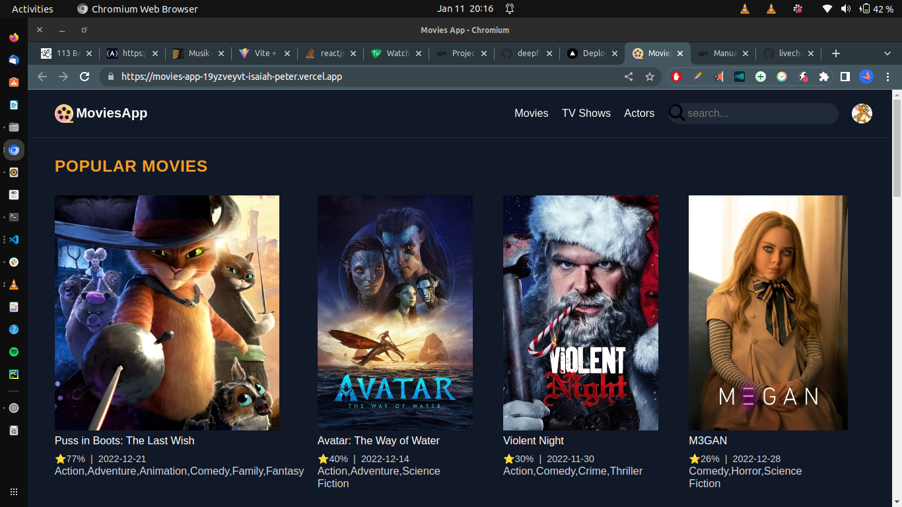
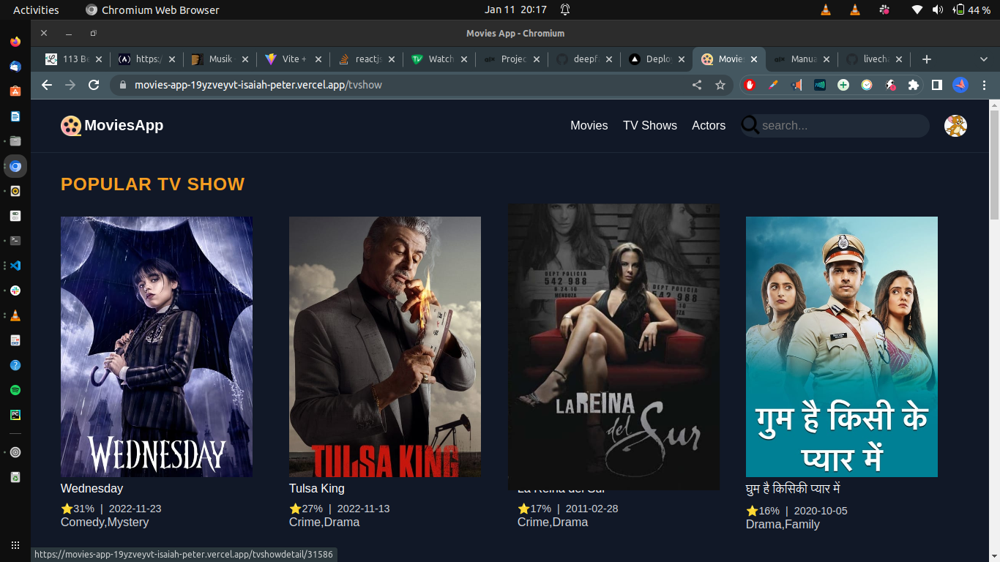
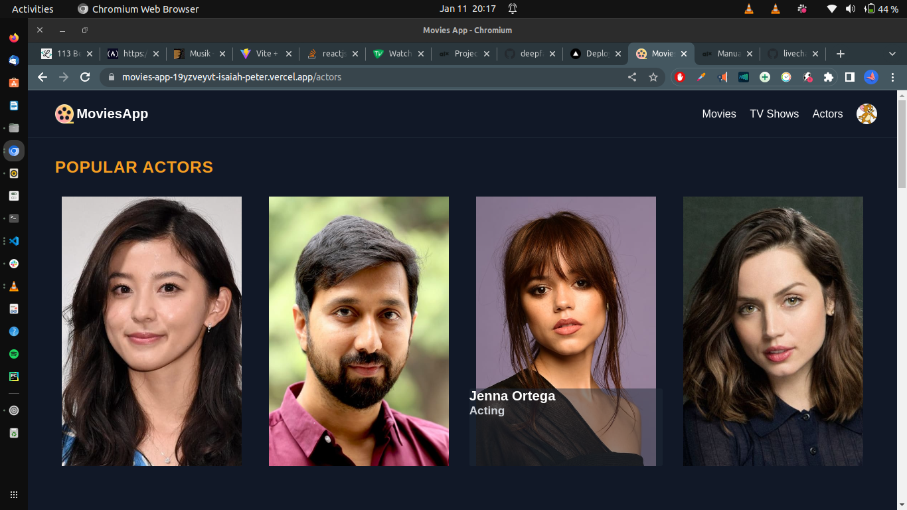

# Movie App

# Introduction
## Author
    Peter Isaiah
https://movies-app-19yzveyvt-isaiah-peter.vercel.app/
Movie App fetch data from themoviesdb. you can search for movies, see the details

## Installation
git clone https://github.com/Isaiah-peter/movies-app.git
cd movies-app
yarn run start

## Usage

Movies page

TVshow page

Actors page

